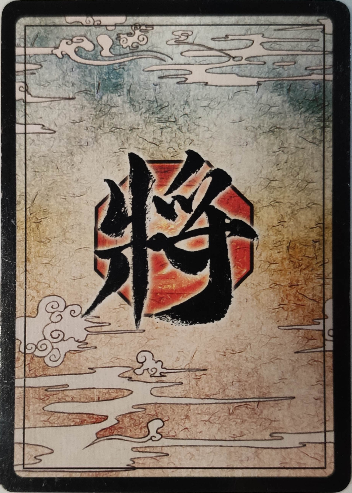
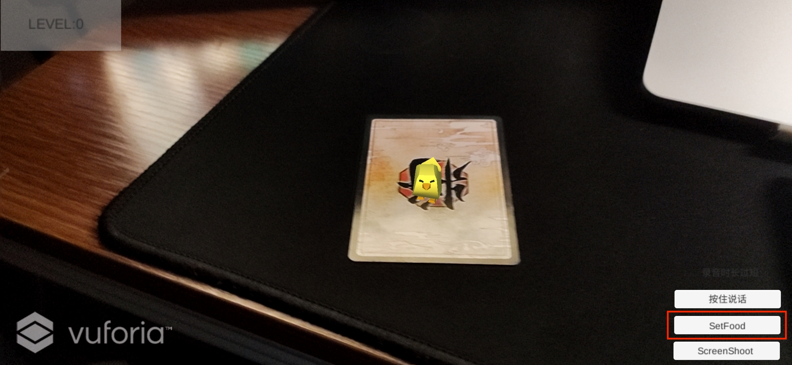
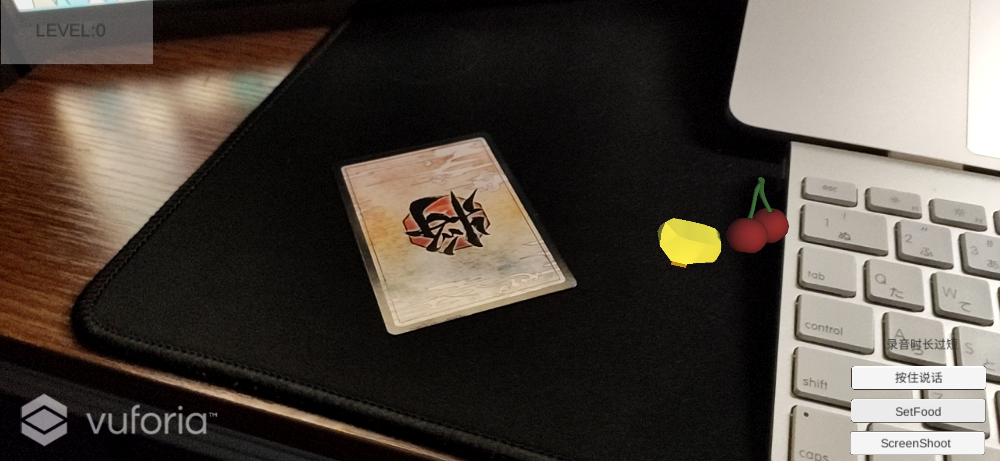
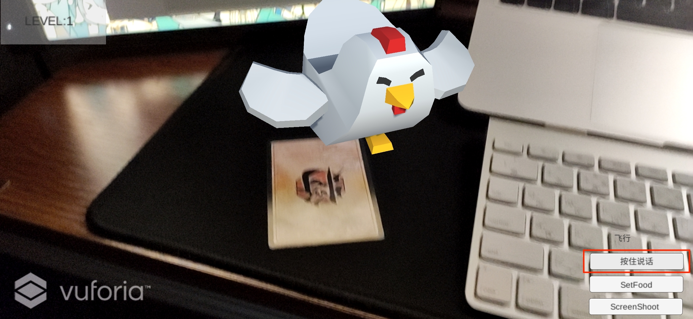
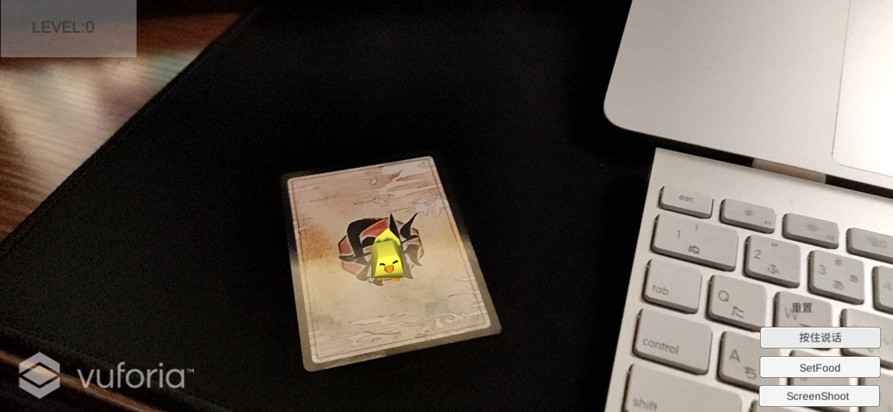
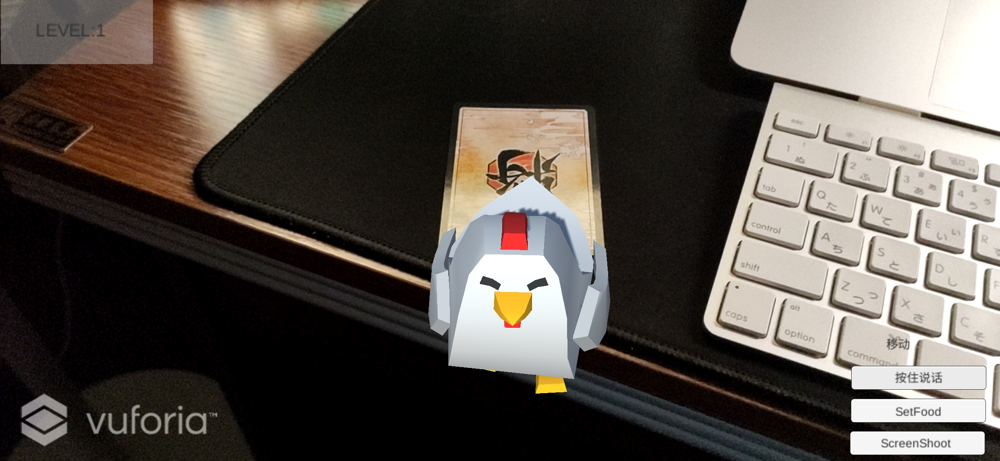

# Introduction

How to run the project?

* Open the project in Unity Editor 2019

  Or

* Install the `.apk` file on your android device

# Functions

## Precondition

We use image recognition function of Vuforia, it mean a picture of below must be needed to load the game object.

It can be printed or just displayed on the screen of any devices you have.

## Generate a random food

After clicking  this button，a random food will be set on the plane. The chick will eat it and become larger. After a number of food has been eaten, the chick will level up and become a chicken.

## Voice Recognition

+ Hold the "按住说话" button, and say "飞行", the chicken will start flying.

  

+ Hold the "按住说话" button, and say "重制", the chicken will be reset.

  

+ Hold the "按住说话" button, and say "移动", the chicken will move.

  

​	